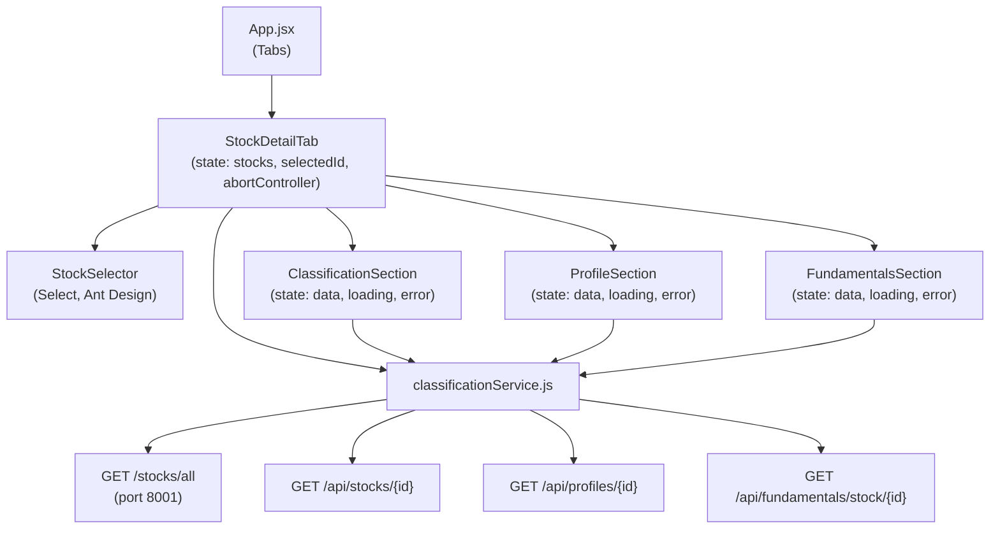
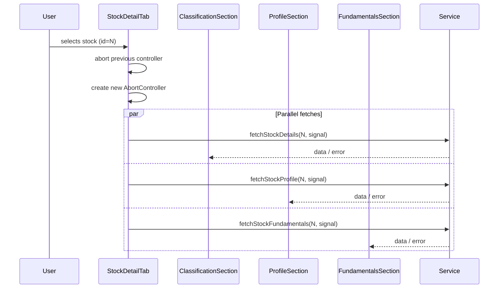

# Design Document: Stock Detail View

## Overview

The Stock Detail View adds a fourth tab ("Stock Detail") to the StoxAtlas React frontend. It provides a read-only, consolidated view of a single stock's classification, profile, and fundamentals data. The user selects a stock from a searchable dropdown; all three data sections then load in parallel, each with independent loading and error states.

The feature is purely additive — it introduces one new top-level component (`StockDetailTab`), three section sub-components, two new service functions, and wires everything into `App.jsx`. No existing components are modified beyond the tab registration.

### Key Design Decisions

1. **Parallel loading with independent error states** — each section manages its own `loading`, `error`, and `data` state. A failure in one section does not block the others. This mirrors the pattern already used in `ProfilesWorkspaceTab` and `StockProfileEditorTab`.

2. **Single AbortController per stock selection** — when the user selects a new stock (or clears the selector), the previous controller is aborted and a new one is created. All three fetch calls share the same controller so a single `abort()` cancels all in-flight requests.

3. **Stock directory loaded once on mount** — `fetchAllStocks` is called once when `StockDetailTab` mounts, exactly as `ProfilesWorkspaceTab` does. The resulting list is reused for the selector options and for resolving parent company / subsidiary IDs in the Profile section.

4. **Fundamentals table orientation** — metrics are rows, financial years are columns (newest → oldest, left → right). This lets the user scan a metric's trend across time in a single horizontal sweep, which is more natural than the transposed layout.

5. **Metric grouping** — the 35 fundamentals metrics are grouped into eight logical sub-groups (Income, Margins, Growth, Returns, Efficiency, Leverage, Liquidity, Cash Flow) rendered as labelled row groups within the table. This avoids an undifferentiated wall of numbers.

6. **Service layer consistency** — all API calls go through `classificationService.js`. Two new exported functions are added; no existing functions are duplicated or modified.

---

## Architecture



**Data flow on stock selection:**



---

## Components and Interfaces

### `StockDetailTab` (new, `src/components/StockDetailTab.jsx`)

Top-level tab component. Owns:
- `stocks: Stock[]` — the full stock directory
- `stocksLoading: boolean`
- `stocksError: string`
- `selectedStockId: number | null`
- `classificationData`, `classificationLoading`, `classificationError`
- `profileData`, `profileLoading`, `profileError`
- `fundamentalsData`, `fundamentalsLoading`, `fundamentalsError`
- `abortControllerRef: React.MutableRefObject<AbortController | null>`

On mount: calls `fetchAllStocks`. On stock selection: aborts previous controller, creates new one, fires three parallel fetches. On clear: resets all data state.

Props: none (self-contained tab).

### `ClassificationSection` (inline or sub-component)

Receives `data`, `loading`, `error`, `onRetry` as props. Renders an Ant Design `Descriptions` component with: Company Name, Macro Sector, Sector, Basic Industry Name, Basic Industry Code, Market Cap Category. Null/absent values render as `—`. Shows `Skeleton` while loading, `Alert` + retry `Button` on error.

### `ProfileSection` (inline or sub-component)

Receives `data`, `loading`, `error`, `onRetry`, `stockDirectory` as props. Renders:
- Text fields (ownership type, risk level, business group, information) as `Descriptions` items
- Array fields (associated brands, locations, clients, products, keynotes) as `Tag` lists
- ID arrays (parent companies, subsidiaries) resolved to names via `stockDirectory`, rendered as `Tag` lists
- Empty arrays and null values render as `—`

### `FundamentalsSection` (inline or sub-component)

Receives `data`, `loading`, `error`, `onRetry` as props. Renders a transposed Ant Design `Table`:
- Columns: a fixed "Metric" column + one column per `financial_year` (sorted newest → oldest)
- Rows: one per metric, grouped into labelled sub-groups
- Null/absent values render as `—`
- Empty dataset renders an `Empty` component with a descriptive message

### Metric Groups

| Group | Metrics |
|---|---|
| Income | total_revenue, net_income, ebitda, free_cash_flow, diluted_eps, book_value_per_share, fcf_per_share |
| Growth | revenue_growth_pct, net_income_growth_pct, eps_growth_pct, ebitda_growth_pct, fcf_growth_pct |
| Margins | gross_margin_pct, operating_margin_pct, ebitda_margin_pct, net_margin_pct, free_cash_flow_margin_pct |
| Returns | roa_pct, roe_pct, roic_pct, roce_pct |
| Efficiency | receivables_turnover_x, inventory_turnover_x, payables_turnover_x, capex_intensity_pct |
| Leverage | debt_to_equity_x, debt_to_assets_pct, net_debt_to_ebitda_x, interest_coverage_x |
| Liquidity | current_ratio_x, quick_ratio_x |
| Cash Flow | cash_flow_to_net_income_x, cash_change |

---

## Data Models

### `Stock` (from StockDirectory)
```typescript
interface Stock {
  id: number;
  name: string;
  symbol: string; // may be empty string
}
```

### `StockDetails` (from GET /api/stocks/{id})
```typescript
interface StockDetails {
  id: number;
  company_name?: string;
  macro_sector?: string;
  sector?: string;
  basic_industry_name?: string;
  basic_industry_code?: string;
  market_cap_category?: string;
  // additional fields passed through
}
```

### `StockProfile` (from GET /api/profiles/{id})
```typescript
interface StockProfile {
  ownership_type?: string | null;
  risk_level?: string | null;
  business_group?: string | null;
  information?: string | null;
  associated_brands?: string[];
  location?: string[];
  clients?: string[];
  products?: string[];
  keynotes?: string[];
  parent_companies?: number[];
  subsidiaries?: number[];
}
```

### `FundamentalsResponse` (from GET /api/fundamentals/stock/{id})
```typescript
interface FundamentalsRow {
  financial_year: number;
  financial_date: string;
  total_revenue?: number | null;
  net_income?: number | null;
  ebitda?: number | null;
  free_cash_flow?: number | null;
  diluted_eps?: number | null;
  book_value_per_share?: number | null;
  fcf_per_share?: number | null;
  revenue_growth_pct?: number | null;
  net_income_growth_pct?: number | null;
  eps_growth_pct?: number | null;
  ebitda_growth_pct?: number | null;
  fcf_growth_pct?: number | null;
  gross_margin_pct?: number | null;
  operating_margin_pct?: number | null;
  ebitda_margin_pct?: number | null;
  net_margin_pct?: number | null;
  roa_pct?: number | null;
  roe_pct?: number | null;
  roic_pct?: number | null;
  roce_pct?: number | null;
  receivables_turnover_x?: number | null;
  inventory_turnover_x?: number | null;
  payables_turnover_x?: number | null;
  debt_to_equity_x?: number | null;
  debt_to_assets_pct?: number | null;
  net_debt_to_ebitda_x?: number | null;
  interest_coverage_x?: number | null;
  current_ratio_x?: number | null;
  quick_ratio_x?: number | null;
  cash_flow_to_net_income_x?: number | null;
  free_cash_flow_margin_pct?: number | null;
  capex_intensity_pct?: number | null;
  cash_change?: number | null;
  has_balance_sheet?: boolean;
  has_cashflow?: boolean;
}

interface FundamentalsResponse {
  stock_id: number;
  stock_name: string;
  count: number;
  rows: FundamentalsRow[];
}
```

### Service additions to `classificationService.js`

```javascript
const STOCK_DETAILS_URL = "http://localhost:8000/api/stocks";
const FUNDAMENTALS_URL  = "http://localhost:8000/api/fundamentals/stock";

export async function fetchStockDetails(stockId, signal) {
  const response = await axios.get(`${STOCK_DETAILS_URL}/${stockId}`, { signal });
  return response.data;
}

export async function fetchStockFundamentals(stockId, signal) {
  const response = await axios.get(`${FUNDAMENTALS_URL}/${stockId}`, { signal });
  return response.data;
}
```

---

## Correctness Properties

*A property is a characteristic or behavior that should hold true across all valid executions of a system — essentially, a formal statement about what the system should do. Properties serve as the bridge between human-readable specifications and machine-verifiable correctness guarantees.*

### Property 1: Stock selector options are sorted alphabetically

*For any* non-empty array of stock objects (with varying names and symbols), the options produced for the StockSelector SHALL be sorted in ascending alphabetical order by stock name.

**Validates: Requirements 2.3**

---

### Property 2: Stock selector label format

*For any* stock object, the selector option label SHALL be `{name} ({symbol})` when `symbol` is a non-empty string, and `{name}` when `symbol` is absent or empty.

**Validates: Requirements 2.3**

---

### Property 3: Classification null fields render as placeholder

*For any* classification data object where one or more fields are null or undefined, the ClassificationSection render output SHALL display `—` for each such field and SHALL NOT display `null`, `undefined`, or an empty string in their place.

**Validates: Requirements 3.5**

---

### Property 4: Classification section displays all required fields

*For any* valid classification data object, the ClassificationSection render output SHALL contain the basic industry name, sector name, and macro sector name values from that object.

**Validates: Requirements 3.2**

---

### Property 5: Profile section displays all required fields

*For any* valid profile data object, the ProfileSection render output SHALL contain representations of ownership type, risk level, business group, information, associated brands, locations, clients, products, keynotes, parent companies, and subsidiaries.

**Validates: Requirements 4.2**

---

### Property 6: Profile null and empty-array fields render as placeholder

*For any* profile data object where one or more fields are null or an empty array, the ProfileSection render output SHALL display `—` for each such field.

**Validates: Requirements 4.5**

---

### Property 7: Parent company and subsidiary IDs resolve to names

*For any* stock directory and any profile whose `parent_companies` or `subsidiaries` arrays contain numeric IDs present in that directory, the ProfileSection SHALL display the corresponding stock names rather than the raw numeric IDs.

**Validates: Requirements 4.6**

---

### Property 8: Fundamentals table structure — years as columns, metrics as rows

*For any* fundamentals response with N year rows, the FundamentalsSection table SHALL have exactly N year-columns (plus the fixed metric label column), and each metric SHALL appear as exactly one row. Year columns SHALL be ordered newest → oldest (left → right).

**Validates: Requirements 5.2**

---

### Property 9: Fundamentals null metric values render as placeholder

*For any* fundamentals response containing rows where one or more metric values are null or undefined, the FundamentalsSection table SHALL display `—` in the corresponding cell and SHALL NOT display `null`, `undefined`, or an empty string.

**Validates: Requirements 5.5**

---

## Error Handling

### Stock directory load failure
- `StockDetailTab` shows an `Alert` with the error message and a "Retry" `Button` above the selector.
- The selector remains disabled until the directory loads successfully.
- Retry calls `fetchAllStocks` with a fresh `AbortController`.

### Per-section fetch failure
- Each section independently shows an inline `Alert` (type `error`) with the error message.
- A "Retry" `Button` is scoped to that section and re-fires only that section's fetch.
- The other two sections are unaffected.

### Request cancellation
- Cancelled requests (axios `CanceledError`) are silently ignored — no error state is set.
- This prevents stale responses from a previous stock selection from overwriting the current state.

### Null / missing API fields
- All field access uses optional chaining (`?.`) and nullish coalescing (`?? "—"`) at the render layer.
- The service layer returns raw API responses without transformation; normalization happens in the component.

---

## Testing Strategy

### Unit tests (example-based)

Focus on specific behaviors and edge cases:

- **Tab registration**: `App` renders a "Stock Detail" tab at index 3.
- **Stock selector loading state**: selector is disabled and shows spinner while `fetchAllStocks` is pending.
- **Stock selector error state**: error alert and retry button appear when `fetchAllStocks` rejects.
- **Empty state**: no data sections visible when selector is cleared.
- **Parallel fetch initiation**: all three fetch functions are called before any resolves when a stock is selected.
- **AbortController cancellation**: selecting a new stock calls `abort()` on the previous controller.
- **Classification loading/error states**: skeleton shown while loading; error + retry shown on failure.
- **Profile loading/error states**: same pattern.
- **Fundamentals loading/error states**: same pattern.
- **Fundamentals empty state**: `Empty` component shown when `count === 0`.
- **Service functions**: `fetchStockDetails` and `fetchStockFundamentals` call the correct URLs.

### Property-based tests

Using [fast-check](https://github.com/dubzzz/fast-check) (already compatible with Vitest, the project's test runner). Each property test runs a minimum of 100 iterations.

| Property | fast-check arbitraries |
|---|---|
| P1: Selector sort order | `fc.array(fc.record({ id: fc.integer(), name: fc.string(), symbol: fc.string() }))` |
| P2: Selector label format | `fc.record({ name: fc.string(), symbol: fc.option(fc.string()) })` |
| P3: Classification null placeholder | `fc.record({ ... }, { requiredKeys: [] })` with random null fields |
| P4: Classification fields present | `fc.record({ basic_industry_name: fc.string(), sector: fc.string(), macro_sector: fc.string(), ... })` |
| P5: Profile fields present | `fc.record({ ownership_type: fc.string(), risk_level: fc.string(), ... })` |
| P6: Profile null/empty placeholder | Profile record with random subsets of fields set to null or `[]` |
| P7: ID resolution | `fc.array(fc.record({ id: fc.integer({ min: 1 }), name: fc.string() }))` + random ID subsets |
| P8: Fundamentals table structure | `fc.array(fc.record({ financial_year: fc.integer(), ... }), { minLength: 1, maxLength: 10 })` |
| P9: Fundamentals null placeholder | Fundamentals rows with random null metric fields |

Tag format for each property test:
```
// Feature: stock-detail-view, Property N: <property_text>
```

### Integration tests

Not required for this feature — all API endpoints are external services tested separately. The service layer functions (`fetchStockDetails`, `fetchStockFundamentals`) are verified by example-based unit tests with mocked axios.
